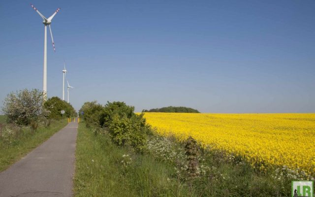
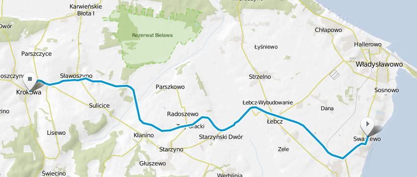
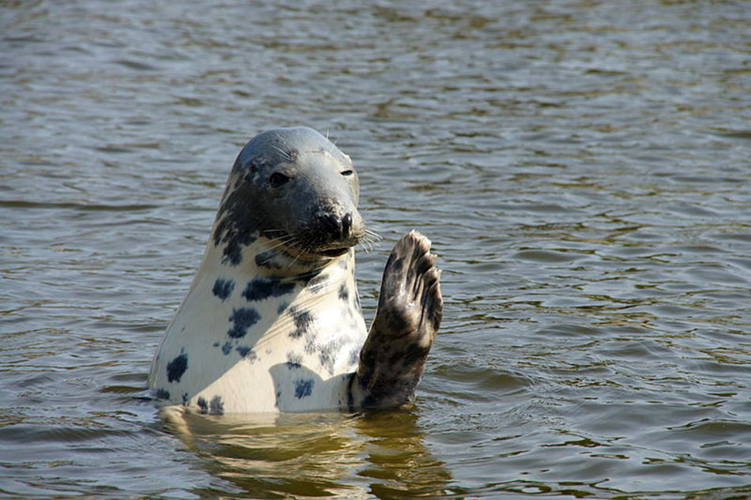

https://jadwiqa.github.io/annak/

# Atrakcje turystyczne pomorza

http://gist.asciidoctor.org/?github-jadwiqa%2Fannak%2F%2FREADME.adoc[Atrakcje turystyczne]

## Trasa rowerowa Swarzewo-Krokowa

## Fokarium Hel

== Atrakcje w danych miejscowościach na pomorzu

[options="footer"]
|===
| Miejscowość	|  atrakcja

| Swarzewo	| Ścieżka rowerowa
| Władysławowo | Ocean Park
| Chałupy | Szkoły kitesurfingu
| Jastarnia | Port
| Hel | Fokarium
|===
Tabela. 1. Atrakcje turystyczne na pomorzu

